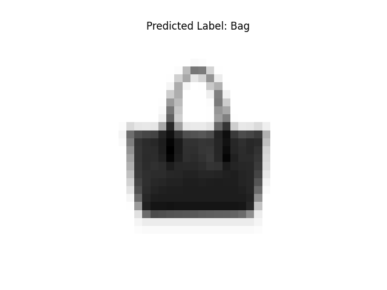

# LeNet-FashionMNIST
This project implements the LeNet convolutional neural network to perform image classification on the Fashion-MNIST dataset. The model was trained and evaluated using PyTorch, achieving a test accuracy of 89.26%.
## Dataset Overview

Below is an overview of the Fashion-MNIST dataset:

---

## Example Input and Output

Here is an example input image (a bag):

And here is the corresponding model output visualization:

